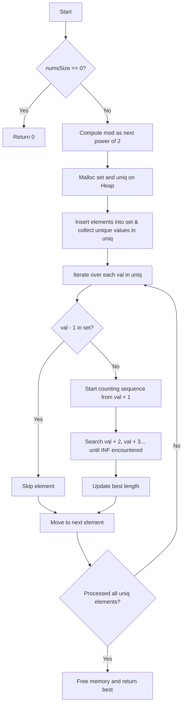

# 128. Longest Consecutive Sequence — Algorithm Idea & Optimization in C

This document explains the core idea behind the optimal $O(N)$ time complexity solution for the "Longest Consecutive Sequence" problem, alongside C-specific low-level performance optimization techniques.

---

## 1. Core Idea

### Problem Statement
Given an unsorted array of integers `nums`, find the length of the longest consecutive elements sequence. The algorithm must run in $O(N)$ time.

*Example*:
- **Input**: `nums = [100, 4, 200, 1, 3, 2]`
- **Output**: `4` (the longest consecutive sequence is `[1, 2, 3, 4]`).

---

### Optimal $O(N)$ Strategy
A simple approach is sorting the array and finding consecutive segments. However, sorting takes $O(N \log N)$ time. To achieve $O(N)$, we must use a **Hash Set** to check for the existence of elements in $O(1)$ average time.

Simply iterating through every number and counting consecutive values starting from it can still degrade to $O(N^2)$ (e.g., if the array is already fully sorted).

To guarantee linear $O(N)$ time complexity, we apply the following rule: **Only start counting a sequence from its absolute minimum element (the Start of Sequence).**

1. Populate all elements in the array into a custom **Hash Set** for $O(1)$ lookup times while deduplicating entries (storing unique elements in the `uniq` array).
2. For each unique element `val` in `uniq`:
   - Check if `val - 1` exists in the Hash Set.
   - **If `val - 1` exists in the set**: Skip `val`. Since `val` is not the beginning of the sequence, the sequence containing it will eventually be counted starting from its smallest element.
   - **If `val - 1` does NOT exist in the set**: This means `val` is the starting element of a sequence. We start a loop to count the length of the sequence (`val`, `val + 1`, `val + 2`, ...).
3. Update the maximum length found so far (`best`).

> **Proof of $O(N)$ Time Complexity**:
> Each element is visited at most twice: once when checking if it can start a sequence (via `val - 1`), and at most once more inside the counting loop (each sequence is scanned exactly once). This guarantees that the total step count is linear relative to $N$.

---

## 2. C-Specific Implementation & Performance Optimization

Since C does not have a built-in Hash Set (like C++'s `std::unordered_set` or Java's `HashSet`), we implement a high-performance custom hash set utilizing low-level hardware optimizations:

### A. Power of Two Sizing
Instead of using an arbitrary size, the hash set size `mod` is rounded up to the next power of 2 such that the load factor is at most 50% (`mod >= 2 * numsSize`).
This yields two major benefits:
- It significantly reduces hash collisions.
- It replaces the slow CPU division/modulo operator (`%`) with a single-cycle bitwise AND (`&`) operation:
  $$\text{index} = \text{hash} \ \& \ (\text{mod} - 1)$$

### B. Fibonacci Hashing (Shift-Right)
To prevent adversarial test cases (e.g., arithmetic progressions with step sizes matching powers of 2 that would cause all elements to collide in the same bucket), we apply **Fibonacci Hashing**:
$$\text{hash} = (\text{val} \times 2654435761\text{u}) \gg \text{shift}$$
- The multiplier $2654435761\text{u} \approx 2^{32} \times (\frac{\sqrt{5}-1}{2})$ is the golden ratio fraction of a 32-bit integer.
- The multiplication effectively scatters the input bit values across the entire $2^{32}$ range.
- Shifting right by `shift` (where $\text{shift} = 32 - \log_2(\text{mod})$) extracts the highest, most well-distributed bits, minimizing collision risks.

### C. Linear Probing & Cache Locality
When a hash collision occurs, the algorithm searches adjacent cells: `hash = (hash + 1) & mask`.
- Linear probing is exceptionally cache-friendly. When a cache line is loaded from system memory, neighboring cells are automatically fetched into the CPU L1/L2 cache. Probing contiguous memory locations avoids slow RAM accesses.

### D. Avoiding Stack Overflow
Rather than using Variable Length Arrays (VLA) on the stack (which can easily cause crash/Segmentation Faults on LeetCode when $N = 10^5$, as it requires $>1.6$ MB of stack space), memory for the hash set and unique list is dynamically allocated on the heap via `malloc` and freed at the end of the function.

---

## 3. Algorithm Flowchart

## 4. Complexity Analysis

- **Time Complexity**: $O(N)$ on average and in the worst case, thanks to Fibonacci hashing distribution and the start-of-sequence filtering.
- **Space Complexity**: $O(N)$ memory overhead to hold the `set` table and `uniq` array.
